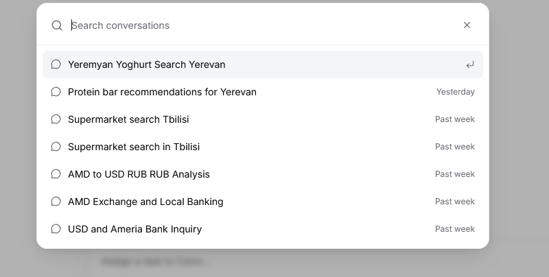
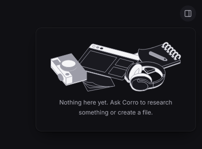
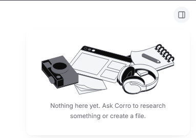

<picture>
  <source media="(prefers-color-scheme: dark)" srcset="Branding/social/github-social-1280x640-dark.png">
  
</picture>

# Corro

**Corro is a self-hosted agent.** Assign it a task — it plans the work, calls tools, reads and writes files, verifies the result against real state, and reports back with evidence. No accounts, no OAuth, no API keys for callers: the server recognises your device and keeps that device's tasks itself.

It comes in two parts: an **API** (the agent behind HTTP) and a **website** (the task frontend).

---

## Screenshots

| | |
|---|---|
|  |  |
| *Home, light* | *Home, dark* |


*A finished task — researched, charted, sourced, and every claim graded (`corroborated`, `partially supported`)*



*Search across conversations (⌘K)*

| | |
|---|---|
|  |  |
| *Model, reasoning effort and Turbo* | *Appearance settings with live preview* |

| | |
|---|---|
|  |  |
| *Empty workspace, dark* | *Empty workspace, light* |

---

## Features

### Does the task, then proves it
- **Agentic loop** — each run plans tool calls, executes them (in parallel where possible), reads the results, and keeps going until the task is actually done. A tool that keeps failing is disabled mid-run instead of blocking it.
- **No false completions** — completion claims are checked against real evidence (files written, pages read). Unverified work is reported as partial, never as done.
- **Graded claims** — every factual claim carries an evidential status: `corroborated`, `partially supported`, `contradicted`, or `unsourced`. Colour in the UI means exactly this and nothing else.
- **Streaming progress** — plain text out as it works, plus a JSON/SSE mode with `text`, `reasoning`, `tool-call`, `tool-result` and `usage` events, so the frontend can render every step live.
- **Task sessions** — every task is stored server-side as JSON with its messages, tool calls and running totals; the client only holds a session id. Rename, pin, search, and delete from the history sidebar, and continue any task later.
- **Follow-up chips** — a microtask model drafts next-step suggestions under each completed task.
- **Read aloud** — ElevenLabs text-to-speech on any message.
- **Context meter** — per-message breakdown of what occupies the context window (system prompt, tools, history, tool results).

### A toolbelt it acts with
| Area | Tools |
|---|---|
| Math | `calculator` — exact arithmetic, no model in the loop |
| Money | `currency_convert` (~200 currencies), live `ameriabank_rates` and `idbank_rates` boards with conversion at those rates |
| Web | `web_search`, `web_extract`, `web_crawl`, `web_map` (Tavily) |
| Groceries (Armenia) | `*_search` / `*_product` / `*_categories` / `*_stores` for Yerevan City, Parma and SAS — live AMD prices, discounts, branch locator |
| Shopping (US + Apple) | `amazon_*`, `walmart_*`, `apple_*`, `istore_*` (iStore.am, Apple's Armenian reseller) |
| Video & social | `youtube_channel`, `youtube_channel_videos`, `youtube_video`, `youtube_comments`, `youtube_transcript`, `instagram_profile`, `instagram_posts`, `instagram_post`, `instagram_comments` |
| Files | `fs_list/read/search/write/edit/rename/delete` inside the session's private workspace, with revision checks against stale overwrites |
| Slides | `create_presentation` — builds a real `.pptx` deck into the workspace |
| Knowledge | `read_skill` — loads skill packs just-in-time (see below) |

### Skills
Task-specific instruction packs that stay **out** of the system prompt until needed — the prompt carries only a compact index, bodies load via `read_skill` or a `/slash` command: `research` (multi-source investigation), `shopping` (which retailer tool per region, no mixed currencies), `social-lookup` (YouTube/Instagram deep-dives), `artifact-builder` (presentations, dashboards, HTML reports).

### Local awareness
Region is detected per request (header, query, proxy, language, GeoIP) and overridable. From Armenia, Corro reaches for Armenian shops and bank boards first on price questions — reference rate *and* what each local bank actually quotes.

### Honest token counting
Every model counts with a fitted tokenizer (`/tokens` endpoint, `/models` status): exact BPE ranks where published, endpoint-calibrated estimates where not. No guessing.

### A frontend that gets out of the way
Light / dark / system themes, inset or edge-to-edge layout, adjustable reading size, and 8 interface languages (English, Հայերեն, Français, Deutsch, Español, 日本語, Português, 한국어). Task results render rich output inline: charts (with table + CSV view), maps, shop products, YouTube clips, rate tables, KaTeX math — plus file uploads, workspace viewer, and Markdown/DOCX export.

---

## Quickstart

**API** — needs Node + pnpm. The default model is served by a free, keyless endpoint, so nothing else is required to start:

```bash
cd API
pnpm install
pnpm tokenizers:prepare && pnpm tokenizers:calibrate   # once, ~6 MB of tokenizer ranks
pnpm dev                                               # :8787
```

```bash
curl -N -X POST localhost:8787/say -d "compare iPhone 17 Pro prices across Yerevan shops and save the winner to picks.md"
# progress streams as plain text; task id returns in the X-Corro-Session header
curl -N -X POST "localhost:8787/say?session=ses_..." -d "now do the same for AirPods Max"
```

Optional keys go in `API/.env` (see `API/.env.example`): fast-mode Modal endpoint, Tavily search keys, ElevenLabs voices, XKIRO for Qwen. Everything unset simply reports as unreachable in `/models`.

**Website:**

```bash
cd website
pnpm install
pnpm dev                                               # :3000
```

Point it at the API with `NEXT_PUBLIC_CORRO_API_URL` (see `website/.env.local`, defaults to `http://localhost:8787`).

---

## Models

| Key | Endpoint | Cost | Notes |
|---|---|---|---|
| `kimi-k3` *(default)* | free keyless mirror | free, unlimited | variable speed (~3–10 tok/s at worst) |
| `kimi-k3-fast` | your Modal deployment | spends credits | same model, fast and steady — the website's **Turbo** toggle |
| `qwen3-max` | xKiro free tier | free tier | 1M context, selectable reasoning effort |

Pick per request (`"model": "kimi-k3-fast"`, `?model=fast`, `"fast": true`) or set `CORRO_DEFAULT_MODEL` / `CORRO_FAST_MODEL`.

## API cheat sheet

| Method | Path | What it does |
|---|---|---|
| `POST` | `/say` | plain text in, streaming plain text out |
| `POST` | `/chat` | full agent run; JSON, or SSE with `"stream": true` |
| `GET` | `/sessions`, `/sessions/:id` | list / inspect (messages, tool calls, usage) |
| `PATCH` / `DELETE` | `/sessions/:id` | rename / forget |
| `GET` | `/models`, `/models/:key` | live model cards + tokenizer status |
| `GET` / `POST` | `/tools`, `/tools/:name` | the toolbelt, and running one tool with no model |
| `GET` | `/prompt` | the system prompt as the agent receives it |
| `POST` | `/tokens` | token counting, optionally prompt + tools included |
| `GET` | `/workspace/view` | a workspace file served as itself |
| `GET` | `/` | the control console |

---

## Project structure

```
API/          the agent: routes, tools, skills, models, tokenizer calibration
  src/agent/    run loop, system prompt, tool implementations, skill loader
  src/routes/   HTTP surface (/say, /chat, /sessions, /models, /tools, …)
  src/tokenizer/ exact token counting + calibration scripts
  skills/       research, shopping, social-lookup, artifact-builder
website/      the Next.js chat frontend
Branding/     logo system, icons, social cards, design tokens (see BRAND.md)
docs/         screenshots used above
```

- `API/README.md` — full endpoint, tool, model and tokenizer reference.
- `website/README.md` — frontend setup and scripts.
- `Branding/BRAND.md` — the logo system and its rules.

## License

ISC.
