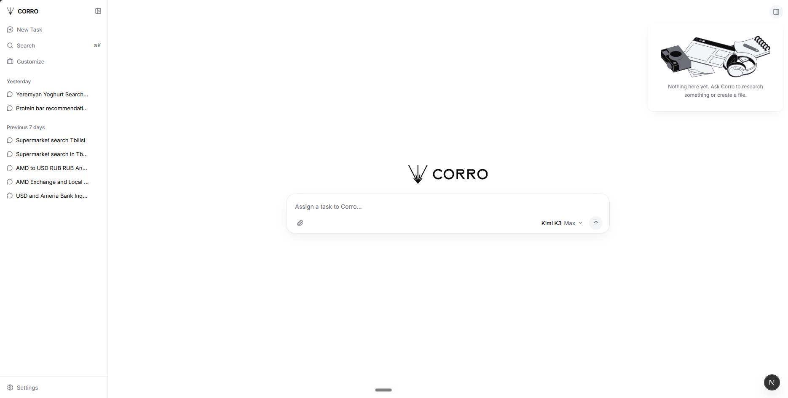
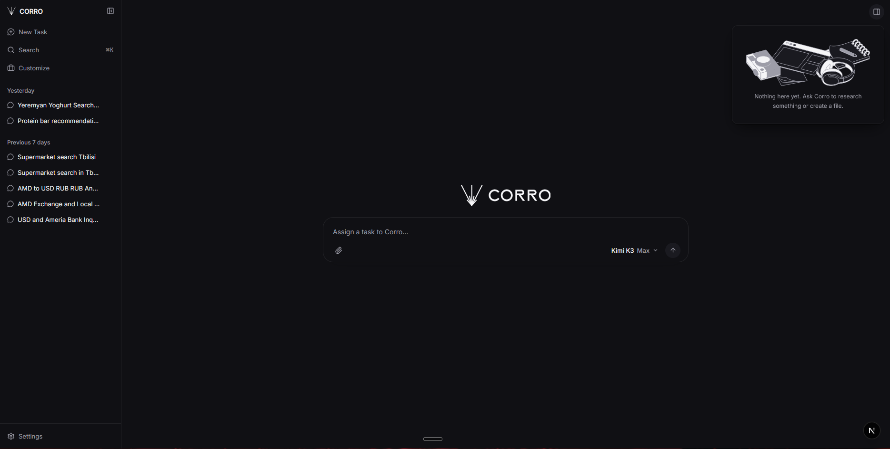
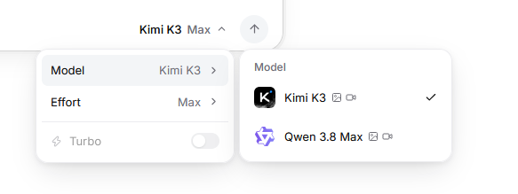
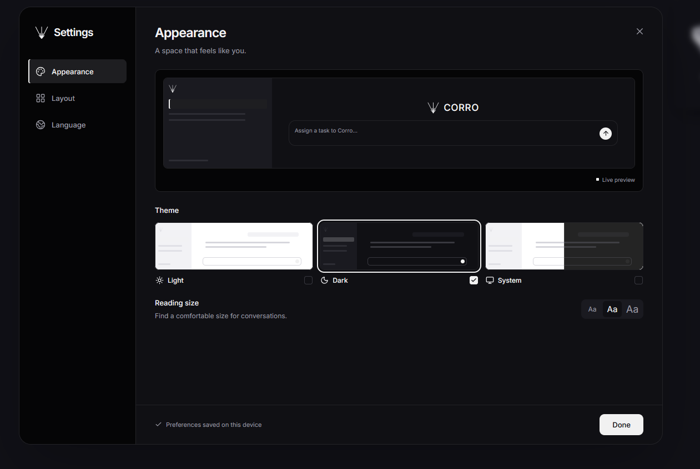

<picture>
  <source media="(prefers-color-scheme: dark)" srcset="Branding/social/github-social-1280x640-dark.png">
  
</picture>

# Corro

**A self-hosted AI agent that does the task, then shows its evidence.**

Give Corro a job in plain language. It plans the steps, uses tools, reads and writes files, checks the result against what actually happened, and reports back with sources. Claims it cannot back up are labelled as such instead of presented as fact.

Corro is a personal project, built around everyday life in Armenia: it knows local supermarkets, bank exchange rates and Apple resellers.

It started during the TUMO Lab "How to make AI Agents", led by Raffi Hovagimian (Senior Software Engineer and AI Engineer at Meta). It turned out to be a genuinely useful agent, so I kept building and improving it after the lab ended.


*A finished task: researched, charted, sourced, and every claim graded.*

---

## What makes it different

**It checks its own work.** Before Corro says "done", it looks for proof: the file really was written, the page really was read. If the proof is missing, the task is reported as partial.

**Every claim has a grade.** Facts in an answer are marked `corroborated`, `partially supported`, `contradicted` or `unsourced`. In the interface, color means this grade and nothing else.

**No accounts, no keys for you.** The server recognises your device and keeps your tasks on its side. There is nothing to sign up for and no API key to pass around.

**It is local by default.** Ask about prices from Armenia and Corro checks Armenian shops first, then shows both the reference exchange rate and what each local bank actually quotes.

**It runs for free.** The default model uses a free endpoint that needs no key, so you can start without paying for anything.

---

## Quickstart

You need Node and pnpm.

### 1. Start the API

```bash
cd API
pnpm install
pnpm tokenizers:prepare && pnpm tokenizers:calibrate   # one time, about 6 MB
pnpm dev                                               # runs on :8787
```

Try it:

```bash
curl -N -X POST localhost:8787/say -d "compare iPhone 17 Pro prices across Yerevan shops and save the winner to picks.md"
```

Progress streams back as plain text, and the task id comes back in the `X-Corro-Session` header. To continue a task, pass that id:

```bash
curl -N -X POST "localhost:8787/say?session=ses_..." -d "now do the same for AirPods Max"
```

### 2. Start the website

```bash
cd website
pnpm install
pnpm dev                                               # runs on :3000
```

The website talks to the API at `http://localhost:8787` by default. Change it with `NEXT_PUBLIC_CORRO_API_URL` in `website/.env.local`.

### Optional keys

Corro works without any of these. Add them to `API/.env` (see `API/.env.example`) to unlock more:

- a fast-mode model endpoint
- Tavily keys for web search
- ElevenLabs voices for read aloud
- an xKiro key for Qwen

Anything you leave unset simply shows as unreachable in `/models`.

---

## Features

### The agent

- **Agentic loop.** Plans tool calls, runs them in parallel where it can, reads the results and continues until the task is done. A tool that keeps failing is switched off mid-run instead of blocking everything.
- **Live progress.** Plain text while it works, or a JSON and SSE mode with `text`, `reasoning`, `tool-call`, `tool-result` and `usage` events.
- **Saved tasks.** Each task is stored on the server with its messages, tool calls and running totals. Rename, pin, search, delete and continue any task later.
- **Follow-up suggestions.** A small model drafts next-step chips under each finished task.
- **Read aloud** on any message: the reply is first turned into clean speakable text (charts become short spoken summaries, currency codes become words) and then voiced through ElevenLabs. A **context meter** shows what fills the context window.

### The toolbelt

| Area | What Corro can do |
|---|---|
| Math | `calculator` for exact arithmetic, no model involved |
| Money | `currency_convert` for about 200 currencies, plus live `ameriabank_rates` and `idbank_rates` |
| Web | `web_search`, `web_extract`, `web_crawl`, `web_map` (Tavily) |
| Armenian groceries | Search, products, categories and branch finder for Yerevan City, Parma and SAS, with live AMD prices and discounts |
| Shopping | Amazon, Walmart, Apple, and iStore.am (Apple's Armenian reseller) |
| Video and social | YouTube channels, videos, comments and transcripts; Instagram profiles, posts and comments |
| Files | List, read, search, write, edit, rename and delete inside a private workspace, with checks against overwriting stale versions |
| Slides | `create_presentation` builds a real `.pptx` deck |
| Skills | `read_skill` loads instruction packs only when needed |

### Skills

Skills are task-specific instruction packs. They stay out of the system prompt until a task needs them, which keeps the agent fast and focused. They load through `read_skill` or a slash command.

- `research`: in-depth investigations across many sources, with source evaluation and a fixed synthesis format
- `shopping`: picks the right retailer tool for the region and never mixes currencies
- `social-lookup`: lookups of specific YouTube videos and Instagram posts, page by page, without inventing IDs
- `artifact-builder`: presentations, dashboards and standalone HTML reports

### The website

- Light, dark and system themes, adjustable layout and reading size
- 8 languages: English, Հայերեն, Français, Deutsch, Español, 日本語, Português, 한국어
- Rich results shown inline: charts (line, bar, scatter, area and pie, with smooth curves, labeled points, reference lines, table and CSV view), maps, products, YouTube clips, rate tables and math
- File uploads, a workspace viewer, search across tasks (⌘K), and export to Markdown or DOCX

| | |
|---|---|
|  |  |
|  |  |

---

## Models

| Key | Where it runs | Cost | Notes |
|---|---|---|---|
| `kimi-k3` (default) | Free keyless mirror | Free | Speed varies, from about 3 to 10 tokens per second at worst |
| `kimi-k3-fast` | Your own Modal deployment | Uses credits | Same model, fast and steady. This is the website's **Turbo** toggle |
| `qwen3-max` | xKiro free tier | Free tier | 1M context, adjustable reasoning effort |

Choose a model per request with `"model": "kimi-k3-fast"`, `?model=fast` or `"fast": true`. To change the defaults, set `CORRO_DEFAULT_MODEL` or `CORRO_FAST_MODEL`.

Token counts use a fitted tokenizer for each model: exact where the ranks are published, calibrated estimates where they are not. See `/tokens` and `/models`.

---

## API at a glance

| Method | Path | Purpose |
|---|---|---|
| `POST` | `/say` | Plain text in, streaming plain text out |
| `POST` | `/chat` | Full agent run, as JSON or as SSE with `"stream": true` |
| `GET` | `/sessions`, `/sessions/:id` | List and inspect tasks |
| `PATCH`, `DELETE` | `/sessions/:id` | Rename or delete a task |
| `GET` | `/models`, `/models/:key` | Model cards and tokenizer status |
| `GET` | `/skills`, `/skills/:name` | Skill index and one skill body |
| `POST` | `/suggestions` | Follow-up chips for a finished turn |
| `GET` | `/speech` | Whether speech is configured, with voice and char limit |
| `POST` | `/speak` | Text in, spoken audio out |
| `GET`, `POST` | `/tools`, `/tools/:name` | List the tools, or run one without a model |
| `GET` | `/prompt` | The system prompt exactly as the agent sees it |
| `POST` | `/tokens` | Count tokens, optionally including prompt and tools |
| `GET` | `/workspace/view` | Serve a workspace file as itself |
| `GET` | `/` | The control console |

The full reference is in [`API/README.md`](API/README.md).

---

## Project structure

```
API/              the agent
  src/agent/        run loop, system prompt, tools, skill loader
  src/routes/       HTTP endpoints
  src/tokenizer/    token counting and calibration
  skills/           research, shopping, social-lookup, artifact-builder
website/          the Next.js frontend
Branding/         logo system, icons, social cards, design tokens
docs/             screenshots
```

More detail: [`website/README.md`](website/README.md) for the frontend and [`Branding/BRAND.md`](Branding/BRAND.md) for the logo rules.

## License

Corro is released under the [PolyForm Noncommercial License 1.0.0](LICENSE). You are free to download it, run it, study it and modify it for yourself, and to use it for personal projects, learning, research and education. You may not sell it or use it for commercial purposes.

If you want to use Corro commercially, get in touch first.
